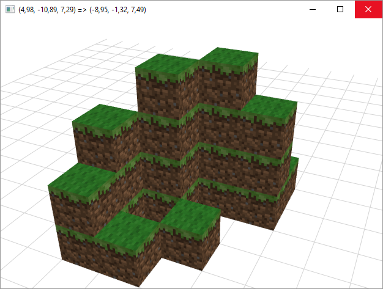

Minecraft Designer
==================

Just a simplistic attempt at making a point-and-click Minecraft-like building application using .NET and WPF. Left-click to place a block, right-click to arc-rotate camera.

Uses Minecraft tiles, Copyright Microsoft I guess.

